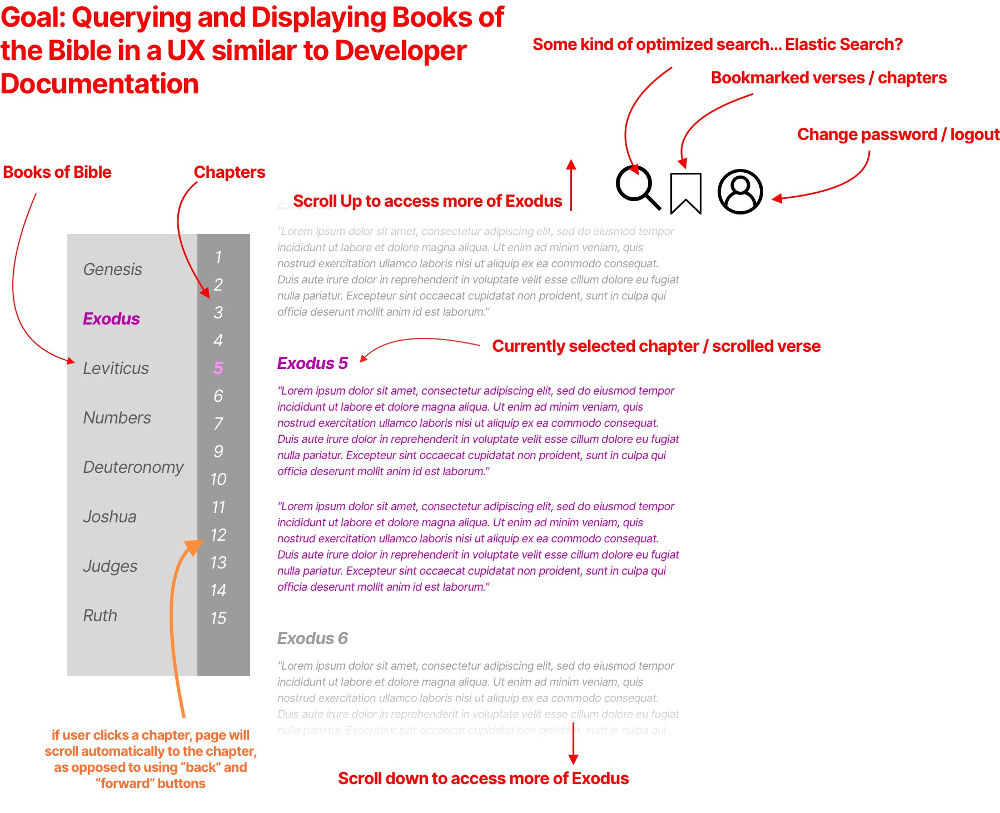

# Easy Bible Viewer Project
Utilizing the [database provided in this repo](https://github.com/scrollmapper/bible_databases) to create an easy-to-use Bible reader.

## Building Documents

The general idea / spec of the project is as follows, but I will update as I get a little further along.

## Technologies Used
* [Knex](https://github.com/knex/knex)
* [Express](https://expressjs.com/)

# Add Database
In order to use this application, grab the most up to date sqlite database of the bible from [the scroll mapper repository](https://github.com/scrollmapper/bible_databases), and copy the `bible-sqlite.db` file into the `/data` directory of this project.